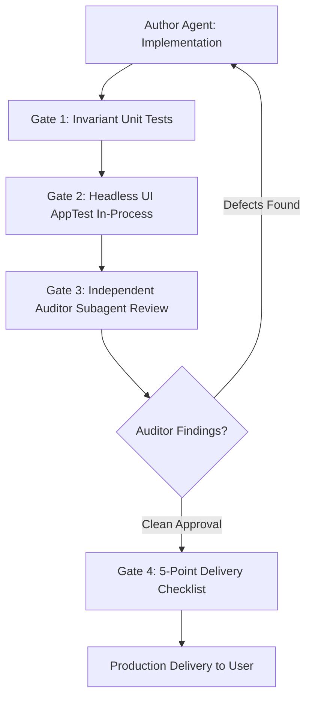

# Quality Assurance & Independent Auditor Architecture Protocol

## 1. Executive Summary & Root Cause Analysis

When an agentic coding assistant develops, modifies, and tests software within the same context, a well-known failure pattern occurs: **The Self-Grading Confirmation Bias**.

In this pattern:
1. **Self-Completed Unit Tests Pass 100%**: The author agent tests the exact happy paths, data structures, and assumptions it used during implementation.
2. **Real-World UI/UX Fails**: In user hands, critical flaws emerge—such as unreactive filters, silent data truncation, or confusing button labels.

### Root Cause Taxonomy of Recent Failures

| Failure Pattern | Real Incident in Backup Importer | Why Self-Tests Passed | How to Prevent in Future |
| :--- | :--- | :--- | :--- |
| **Layer Mismatch** | Segmented filter selection did not update the table; button text implied importing 401 instead of 23. | Tests in `test_vault.py` verified backend Python functions (`scan_offsite_source`), never executing the Streamlit script (`app.py`). | **Headless UI Testing Gate (`st.testing.v1.AppTest`)**: UI scripts must be executed and simulated in-process before release. |
| **Brittle String Coupling** | Filtering checked `elif "Already in Vault" in table_filter:`, but the UI label was dynamically formatted as `"✅ Verified Identical (378)"`. | Backend test never inspected the Streamlit branch conditions. | **Decoupled Machine Keys**: Never branch on human display labels; branch on immutable enum/machine keys. |
| **Silent Truncation** | Dataframe sliced with `items[:50]`, hiding 351 discovered sessions with zero user notification. | Backend test returned 401 items; UI silently discarded 88% of them. | **Conservation Invariant Assertion**: Assert rendered count equals source count or explicit pagination controls exist. |
| **Transient State Coupling** | Assertion `self.assertEqual(matching_evicted, 22)` failed once the 23 items were actually ingested into the catalog. | Test asserted a transient snapshot in time rather than an invariant property. | **Property/Invariant Testing**: Assert mathematical conservation laws ($\sum \text{buckets} = \text{total}$) rather than brittle literals. |
| **Widget Deselection Flaw** | Deselecting a segmented control returns `None`, crashing or falling through unexpectedly. | Author assumed the widget always has a selected value. | **Null-Safe Fallback Contract**: Always bind `active_filter = selected_filter or default_key`. |
| **Widget Lifecycle Violation** | Clicking "View in Explorer" raised `StreamlitWidgetAlreadyInstantiatedError` because `main_nav_tab` was modified mid-script. | Previous UI tests verified static filters and search, but never simulated clicking the receipt navigation button. | **Pre-Rerun Callback Pattern**: Never modify keyed widget state in an inline `if st.button:` body; use `on_click` callbacks which execute before rerun. |

---

## 2. The 4-Tier Defense Architecture

To guarantee that bugs and oversights are trapped before reaching the user, four quality gates are established:



### Gate 1: Invariant-Based Property Testing (Backend)
- Avoid hardcoding literal integers against mutable production environments.
- Enforce mathematical contracts:
  - **Reconciliation Invariant**: $\text{matching\_evicted} + \text{brand\_new} + \text{missing\_assets} + \text{newer\_content} + \text{already\_archived} \equiv \text{total\_discovered}$.
  - **Actionable Invariant**: $\text{actionable\_count} \equiv \text{matching\_evicted} + \text{brand\_new} + \text{missing\_assets} + \text{newer\_content}$.
  - **Ordering Invariant**: Actionable items must precede non-actionable items in the rendered list.
  - **Non-Clobbering Invariant**: Ingesting offsite data must never overwrite or downgrade a `complete_active` session or wipe existing asset flags.

### Gate 2: Headless UI Integration Testing (`st.testing.v1.AppTest`)
Unit tests cannot verify Streamlit reactivity. Every interactive feature must be accompanied by an `AppTest` test case in [`tests/test_ui_apptest.py`](file:///d:/Developer/agy-dashboard/tests/test_ui_apptest.py):
1. **Widget Key & Reactivity**: Simulate setting widget values (`at.segmented_control(...).set_value(...).run()`) and assert that the resulting UI elements (`at.dataframe`, `at.metric`, `at.info`) reflect the state change.
2. **Empty State & Boundary Verification**: Test what renders when count is 0 (assert `st.info` renders, no unhandled IndexError) vs. when count is $N$.
3. **Hermetic Synthetic Datasets**: Use in-memory synthetic datasets to test UI rendering independently of live filesystem states.

### Gate 3: The Independent Auditor Subagent Protocol
Antigravity supports multi-agent workflows via `define_subagent` and `invoke_subagent`.

An **Auditor Subagent** must be invoked with an **adversarial review persona**:
- The auditor does *not* read the author's self-congratulatory notes.
- The auditor asks: *"How can this break?"*, *"Where is data silently dropped?"*, *"What happens when a user clicks the active button again to deselect it?"*, *"Are display strings decoupled from logic?"*

#### Auditor Agent Specification:
```python
AUDITOR_SPEC = {
    "TypeName": "quality-auditor",
    "Role": "Adversarial Code & UX Auditor",
    "Prompt": """
    Conduct an adversarial review of the proposed changes:
    1. UI Reactivity: Check all Streamlit widgets. Are machine keys decoupled from format_func labels? Does deselecting return None?
    2. Data Integrity: Check for silent slicing (e.g. [:50]), dropped keys, or mutable database coupling.
    3. Mathematical Reconciliation: Do all summary KPIs sum to 100% of discovered items?
    4. Test Completeness: Are there both backend unit tests AND headless UI tests (st.testing.v1.AppTest)?
    5. Invariant Rigor: Are test assertions checking invariants or brittle hardcoded literals?
    Report all defects with file paths, line numbers, and required remediation.
    """
}
```

### Gate 4: The Pre-Delivery Adversarial Checklist (6-Point Gate)
Before marking any user task complete, the assistant must verify:
1. [x] **Layer Completeness**: Both backend logic and Streamlit UI have automated tests.
2. [x] **Widget Lifecycle & Callback Contract**: All cross-tab navigation and keyed widget mutations use `on_click` callbacks (zero inline `st.session_state[widget_key]` assignments).
3. [x] **Reactivity & Null Safety**: All widgets handle deselection (`None`) and reactive updates cleanly.
4. [x] **Conservation**: 100% of data is accounted for; no silent drops or truncations.
5. [x] **Idempotence**: Tests pass cleanly against both fresh and pre-existing database states.
6. [x] **Automated Suite Run**: Executed `run_tests.bat` (or `python -m unittest discover tests`) with **0 failures and 0 errors**.

---

## 3. Standard Test Runner

All developers and agents can execute the unified test suite using:
```cmd
run_tests.bat
```
or via CLI:
```bash
python -m unittest discover tests -v
```
All 20 tests (17 backend + 3 headless UI tests) must pass with Exit Code 0.
